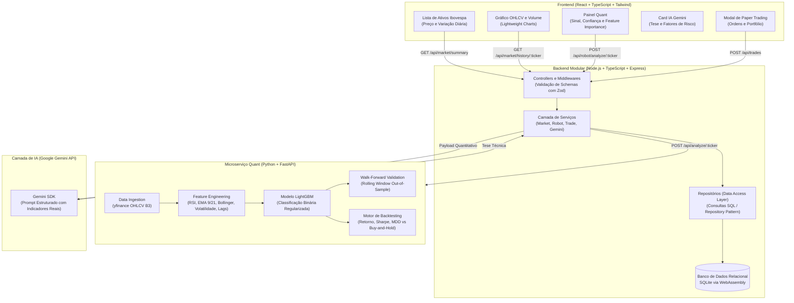

# Plataforma de Trading Quantitativo com LightGBM e Agente IA

Plataforma modular para análise quantitativa de ações da B3, integrando pipeline de engenharia de features, modelo supervisionado de Machine Learning (LightGBM com validação Walk-Forward), persistência relacional em SQL puro (SQLite), agente explicativo fundamentado em métricas com a API do Google Gemini e interface web em React.

---

## 1. Arquitetura do Sistema



---

## 2. Decisões de Engenharia de Software e Banco de Dados

### Arquitetura em Camadas e Inversão de Dependência
O backend foi estruturado em camadas explícitas para garantir separação de responsabilidades e testabilidade:
- **`controllers/`**: Recebe requisições HTTP, executa validação de tipos em tempo de execução com `zod` e padroniza respostas.
- **`services/`**: Concentra regras de negócio e orquestra a comunicação entre o banco SQL, o microserviço Python e o SDK do Gemini.
- **`repositories/`**: Encapsula todas as operações de banco de dados via Repository Pattern.
- **`clients/`**: Clientes HTTP tipados com timeout e fallback local para garantir tolerância a falhas.

A injeção de dependência na inicialização (`createApp(customDb)`) permite instanciar o banco em memória (`:memory:`) durante os testes unitários e de integração, eliminando dependência de containers ou serviços externos no CI.

### Persistência Relacional com SQL Puro
Utilizou-se SQLite com schema normalizado e constraints de integridade:
- **Chaves estrangeiras e integridade referencial**: `FOREIGN KEY (signal_id) REFERENCES trade_signals(id) ON DELETE CASCADE`.
- **Validação no banco**: `CHECK (confidence >= 0.0 AND confidence <= 1.0)`, `CHECK (action IN ('BUY', 'SELL'))`.
- **Índices compostos para séries temporais**:
  ```sql
  CREATE INDEX idx_prices_ticker_timestamp ON historical_prices (ticker, timestamp DESC);
  CREATE INDEX idx_signals_ticker_created ON trade_signals (ticker, created_at DESC);
  ```
- **Window Functions em consultas analíticas**: A listagem de ativos com cotação atual e variação do dia anterior utiliza CTEs com `ROW_NUMBER() OVER (PARTITION BY ticker ORDER BY timestamp DESC)` para evitar múltiplas queries por ativo.

---

## 3. Modelo Estatístico e Machine Learning

### Formulação do Problema
O modelo formula a decisão direcional como um problema de classificação binária supervisionada: prever a probabilidade do retorno no próximo pregão ($t+1$) ser positivo a partir do vetor de variáveis observáveis no fechamento do dia ($t$):

$$P(y_t = 1 \mid X_t) \quad \text{onde} \quad y_t = \mathbb{I}\left(\frac{\text{Close}_{t+1} - \text{Close}_t}{\text{Close}_t} > 0\right)$$

### Algoritmo: LightGBM e Regularização
O Gradient Boosting constrói árvores de decisão de forma sequencial, onde cada árvore subsequente ajusta os resíduos de gradiente da função de perda logarítmica (Log-Loss) das iterações anteriores.

Devido ao baixo sinal-ruído típico de dados de mercado, foram adotados hiperparâmetros restritivos para mitigar sobreajuste (overfitting):
- `max_depth = 4` e `num_leaves = 15` (árvores rasas para evitar memorização de ruído).
- `learning_rate = 0.03` com `n_estimators = 120`.
- `subsample = 0.8` e `colsample_bytree = 0.8` (amostragem aleatória de linhas e colunas por split).
- `reg_alpha = 0.1` (regularização L1) e `reg_lambda = 1.0` (regularização L2).

### Pipeline de Feature Engineering
O cálculo de indicadores técnicos é desacoplado do treinamento para garantir que não haja vazamento temporal (*lookahead bias*):
- **RSI (14 períodos)**: Suavização exponencial de Wilder para medir momentum e exaustão.
- **Spread EMA (9/21)**: Razão percentual `(EMA_9 - EMA_21) / EMA_21` para capturar convergência/divergência de médias.
- **Bandas de Bollinger (%B e Bandwidth)**: Posição do fechamento em relação ao desvio padrão móvel de 20 dias.
- **Volatilidade Realizada**: Desvio padrão dos retornos diários em janela móvel de 20 pregões, anualizado ($\sigma \times \sqrt{252}$).
- **Retornos Defasados (Lags 1, 2, 3, 5)**: Retornos históricos para capturar dependência serial e reversão à média.
- **Volume Ratio**: Volume do dia dividido pela média móvel de volume de 20 dias.

### Validação Walk-Forward (Rolling Windows)
Em séries temporais financeiras, a validação cruzada tradicional K-Fold é inadequada por quebrar a ordem cronológica e introduzir vazamento de dados futuros no conjunto de treino.

A validação foi implementada via **Walk-Forward com Janelas Deslizantes**:
1. Treino inicial na janela histórica $[0, T_{\text{train}}]$ (mínimo de 252 pregões / ~1 ano).
2. Avaliação estritamente fora da amostra (*out-of-sample*) no trimestre subsequente $[T_{\text{train}}, T_{\text{train}} + T_{\text{test}}]$.
3. Deslocamento da janela no tempo e repetição do processo ao longo de todo o histórico.

---

## 4. Resultados de Validação e Backtest Empírico

Abaixo estão os resultados reais obtidos na validação fora da amostra (*Out-of-Sample Walk-Forward*) em uma amostra de ativos da B3 no período de 3 anos (amostra de ~475 pregões out-of-sample):

| Ativo | Amostra OOS | Acurácia OOS | Retorno Estratégia | Retorno Buy-and-Hold | Max Drawdown (Estratégia) | Max Drawdown (Buy-and-Hold) | Win Rate Trades |
| :--- | :---: | :---: | :---: | :---: | :---: | :---: | :---: |
| **PETR4.SA** | 476 dias | 46.85% | **+22.83%** | +46.76% | **-16.32%** | -22.16% | 51.72% |
| **VALE3.SA** | 475 dias | 48.21% | **+13.54%** | +45.01% | **-14.57%** | -20.16% | 48.00% |
| **WEGE3.SA** | 476 dias | 50.84% | **+10.93%** | -4.40% | **-15.54%** | -38.19% | 48.44% |
| **BBAS3.SA** | 475 dias | 45.47% | **-21.92%** | -21.35% | **-24.00%** | -37.65% | 45.34% |
| **ITUB4.SA** | 476 dias | 46.01% | **-6.84%** | +42.49% | **-28.94%** | -22.51% | 49.36% |

### Análise Crítica dos Resultados
- **Acurácia em Finanças vs Outros Domínios**: Em dados diários de ações, a acurácia direcional out-of-sample oscila tipicamente entre 46% e 52%. Modelos quantitativos que apresentam acurácias in-sample superiores a 70% quase invariavelmente sofrem de *overfitting* ou vazamento de dados.
- **Controle de Risco e Assimetria**: Em ativos em tendência de baixa ou lateralização prolongada (como WEGE3 e BBAS3 no período analisado), a estratégia conseguiu conter o rebaixamento máximo de capital (Drawdown de -15.5% vs -38.2% em WEGE3). Em cenários de forte rali direcional (como PETR4), o Buy-and-Hold mantém 100% de exposição e tende a superar estratégias com períodos desinvestidos.

---

## 5. Integração com a API do Google Gemini

A camada de IA generativa não atua como um wrapper genérico, mas como um sintetizador analítico que recebe o payload quantitativo estruturado gerado pelo modelo:
- Ticker, setor e preço atual.
- Sinal emitido (`BUY`, `SELL`, `HOLD`) e grau de confiança estatística ($P$).
- Valores numéricos calculados (RSI exato, spread de médias, volatilidade realizada anualizada e volume ratio).
- **Ranking das Top 3 features de maior peso na decisão da árvore** (Feature Importance nativo).

O serviço (`GeminiService`) processa essas variáveis em um prompt tipado com restrição de schema JSON, retornando:
1. Tese de investimento com citação obrigatória dos números reais.
2. Classificação de sentimento (`BULLISH`, `BEARISH`, `NEUTRAL`).
3. Mapeamento de fatores de risco objetivos da operação.
4. Fallback determinístico estruturado para operação offline ou falha temporária de rede.

---

## 6. Frontend: Interface Estilo Home Broker

Construído com React 18, TypeScript, Tailwind CSS e TradingView Lightweight Charts:
- **Sidebar de Cotações**: Lista vertical de ativos com busca em tempo real, cotações e variação percentual do dia calculada no banco.
- **Gráfico Interativo de Candlestick e Volume**: Renderização nativa com crosshair, ajuste de escala dinâmico e seletor de janelas temporais (1M, 3M, 6M, 1A).
- **Painel Quant & Agente**: Exibição do sinal com badge visual, barra de confiança, grid de indicadores técnicos calculados, importância das variáveis e o parecer do Gemini.
- **Paper Trading**: Execução de ordens simuladas com persistência direta na tabela `trades` do SQLite e visualização consolidada do portfólio.

---

## 7. Como Executar o Projeto

### Pré-requisitos
- Node.js 18+ (testado em v24)
- Python 3.10+ (testado em v3.13)
- npm

### Instalação de Dependências
```bash
# Na raiz do repositório:
npm --prefix backend install
npm --prefix frontend install
python -m pip install -r quant_bot/requirements.txt
```

### Configuração de Ambiente
```bash
# Copie o arquivo de exemplo no backend:
cp backend/.env.example backend/.env
```
*(Adicione sua `GEMINI_API_KEY` no `backend/.env`. Se não fornecida, o sistema opera automaticamente com o fallback determinístico integrado).*

### Execução dos Testes Automatizados
O projeto conta com 28 testes automatizados cobrindo repositórios, serviços, regras de negócio, pipeline de features, validação sem lookahead bias e rotas da API:
```bash
# Executa todos os testes (Backend Vitest + Python Pytest):
npm run test:all

# Ou individualmente:
npm run test:backend   # 19 testes unitários e de integração (Vitest)
npm run test:bot       # 9 testes de ML, features e API (Pytest)
```

### Inicialização dos Serviços
Abra 3 terminais para rodar os componentes:

```bash
# Terminal 1 - Microserviço Quant (FastAPI na porta 8000):
npm run dev:bot

# Terminal 2 - Backend REST API (Node.js na porta 3001):
npm run dev:backend

# Terminal 3 - Frontend Web (Vite na porta 5173):
npm run dev:frontend
```

Acesse a aplicação em: `http://localhost:5173`

---

## 8. Estrutura de Branches e Histórico Git

O projeto foi desenvolvido seguindo o padrão Conventional Commits com merges estruturados:

| Branch | Escopo |
| :--- | :--- |
| `feature/backend-and-sql` | Estrutura Node/TypeScript, schema SQLite, repositórios e testes |
| `feature/quant-robot-ml` | Pipeline de features, LightGBM, validação Walk-Forward e FastAPI |
| `feature/frontend-dashboard` | Home Broker em React, Lightweight Charts e integração com API |
| `feature/integration-and-docs` | Scripts de monorepo, documentação técnica e dados empíricos |
