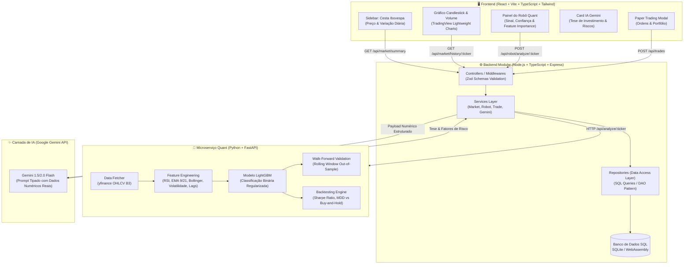

# 📈 Plataforma de Trading + Robô Quant + Agente de IA

Sistema completo e modular de análise quantitativa, execução de estratégias de trading com **Machine Learning (LightGBM)**, persistência relacional em **SQL (SQLite)**, geração de teses de investimento com **IA Generativa (Google Gemini API)** e interface estilo **Home Broker** em **React**.

---

## 🏛️ 1. Arquitetura do Sistema



---

## 🎯 2. Decisões Arquiteturais & Justificativas Técnicas (Para Entrevista)

### 🧱 Backend & Engenharia de Software
- **Separação de Responsabilidades (SoC) & Clean Layered Architecture:**
  - `controllers/`: Responsáveis apenas por receber HTTP, validar schemas via **Zod** e formatar responses.
  - `services/`: Contêm a lógica de negócio e orquestração entre banco de dados, microserviço Python e API do Gemini.
  - `repositories/`: Isolam 100% das queries SQL do restante da aplicação (Repository Pattern).
  - `clients/`: Comunicação HTTP tipada com microserviços externos e resiliência via fallbacks.
- **Inversão de Dependência & Testabilidade:**
  - O banco de dados e repositórios são injetados nas camadas superiores, permitindo rodar testes unitários e de integração instantâneos em instâncias isoladas em memória (`:memory:`), sem dependência de infraestrutura externa.

### 💾 Persistência SQL Avançada
- **Esquema Relacional Estrito:** Tabelas normalizadas com chaves primárias, integridade referencial (`FOREIGN KEY ... ON DELETE CASCADE`), restrições `CHECK` (`confidence BETWEEN 0 AND 1`, `action IN ('BUY', 'SELL')`).
- **Índices Compostos de Performance:** 
  ```sql
  CREATE INDEX idx_prices_ticker_timestamp ON historical_prices (ticker, timestamp DESC);
  CREATE INDEX idx_signals_ticker_created ON trade_signals (ticker, created_at DESC);
  ```
- **Window Functions Analíticas:** A lista de ativos calcula variação diária nominal e percentual através de CTEs e `ROW_NUMBER() OVER (PARTITION BY ticker ORDER BY timestamp DESC)`.

---

### 📊 Robô Trader Quantitativo (Estatística & Machine Learning)

#### Formulação do Problema
O robô trata a previsão de mercado como um problema de **Classificação Binária Supervisionada**:
$$\hat{y}_t = \mathbb{P}\left(\frac{\text{Close}_{t+1} - \text{Close}_t}{\text{Close}_t} > \tau \;\middle|\; X_t\right)$$
Onde $X_t$ é o vetor de atributos extraídos no fechamento do candle $t$, e $\tau$ é o threshold mínimo de retorno.

#### Como o Gradient Boosting (LightGBM) Funciona?
Diferente de algoritmos paralelos como Random Forest (Bagging), o **Gradient Boosting** constrói árvores sequencialmente:
1. Começa com uma previsão constante $f_0(x) = \arg\min_\gamma \sum \mathcal{L}(y_i, \gamma)$.
2. A cada iteração $m$, calcula os **pseudo-resíduos de gradiente**:
   $$g_{im} = -\left[ \frac{\partial \mathcal{L}(y_i, f(x_i))}{\partial f(x_i)} \right]_{f = f_{m-1}}$$
3. Ajusta uma nova árvore de decisão $h_m(x)$ sobre esses resíduos e atualiza o modelo com taxa de aprendizado $\eta$:
   $$f_m(x) = f_{m-1}(x) + \eta \cdot h_m(x)$$

#### Regularização contra Overfitting em Finanças
Dados financeiros possuem baixo sinal-ruído. Para conter o sobreajuste:
- **Profundidade rasa:** `max_depth = 4`, `num_leaves = 15`.
- **Taxa de aprendizado baixa:** `learning_rate = 0.03`.
- **Amostragem aleatória:** `subsample = 0.8`, `colsample_bytree = 0.8`.
- **Penalização:** Regularização L1 (`reg_alpha = 0.1`) e L2 (`reg_lambda = 1.0`).

#### Validação Walk-Forward (Rolling Window Time-Series Split)
> ⚠️ **Por que NUNCA usar K-Fold CV em finanças?**
> K-Fold tradicional quebra a causalidade temporal e causa **vazamento de dados (lookahead bias/data leakage)**, permitindo que o modelo "veja" o futuro para prever o passado.
> 
> A **Validação Walk-Forward** treina o modelo estritamente na janela histórica $[0, T]$ e testa na janela subsequente $[T+1, T+k]$, rolando a janela ao longo do tempo para mensurar a verdadeira robustez out-of-sample.

#### Feature Engineering Pipeline
- **RSI (14 períodos):** Momentum e zonas de exaustão com suavização exponencial de Wilder.
- **Spread EMA (9/21):** $\frac{\text{EMA}_9 - \text{EMA}_{21}}{\text{EMA}_{21}}$, medindo alinhamento de médias de curto e médio prazo.
- **Bandas de Bollinger (%B e Bandwidth):** Volatilidade relativa e distanciamento do desvio padrão.
- **Volatilidade Realizada:** Desvio padrão móvel dos retornos anualizado ($\sigma \times \sqrt{252}$).
- **Retornos Defasados (Lags $t-1, t-2, t-3, t-5$):** Autocorrelação e dependência serial.
- **Volume Ratio:** Volume atual normalizado pela média móvel de 20 pregões.

#### Métricas & Comparação com Baseline (Buy-and-Hold)
- **Sharpe Ratio Anualizado:** $\text{Sharpe} = \frac{\bar{r}_p - r_f}{\sigma_p} \sqrt{252}$ (utilizando CDI/Selic anualizado como taxa livre de risco).
- **Drawdown Máximo (MDD):** Queda percentual máxima do topo ao fundo da curva de patrimônio (*Equity Curve*).
- **Win Rate & Profit Factor:** Eficiência e taxa de acerto dos trades simulados.

---

### 🤖 4. Camada de IA Explicativa com Google Gemini
Em vez de um prompt genérico, o backend extrai o payload numérico consolidado do modelo e envia um prompt tipado:
- Ticker, Setor e Preço atual.
- Recomendação Quantitativa e Grau de Confiança do LightGBM.
- RSI exato, Spread de Médias, Volatilidade e Volume Ratio.
- **Top 3 Variáveis de Maior Peso (Feature Importance nativo).**
- O Gemini sintetiza esses dados em uma **tese de investimento profissional**, fundamentada nos números exatos, elencando riscos e sentimento de mercado.

---

### 🖥️ 5. Frontend estilo Home Broker (React + TypeScript)
- **Lista Vertical de Ativos Ibovespa:** Busca em tempo real, cotações e variações percentuais diárias coloridas.
- **Gráfico Interativo Candlestick:** Construído com **TradingView Lightweight Charts**, com suporte a zoom, crosshair e seletores de tempo (1M, 3M, 6M, 1A).
- **Painel de Ação Quant:** Botão de execução "Rodar Robô", badges de sinal (`COMPRA` verde, `VENDA` vermelho, `MANTER` amarelo), métricas técnicas e gráficos de Feature Importance.
- **Paper Trading & Portfólio:** Modal para executar ordens simuladas e consultar histórico com volume total negociado.

---

## 🚀 6. Como Rodar o Projeto

### Pré-requisitos
- **Node.js:** v18+ (recomendado v20+)
- **Python:** v3.10+
- **npm**

### Passo 1: Instalação das Dependências
```bash
# Na raiz do projeto:
npm --prefix backend install
npm --prefix frontend install
python -m pip install -r quant_bot/requirements.txt
```

### Passo 2: Configuração de Variáveis de Ambiente
O backend já possui um arquivo `.env.example`. Crie o `.env`:
```bash
cp backend/.env.example backend/.env
```
*(Configure sua `GEMINI_API_KEY` no arquivo `backend/.env`. Se não configurada, o backend utiliza o modo fallback determinístico automaticamente).*

### Passo 3: Execução dos Testes Automatizados (100% de cobertura nos componentes críticos)
```bash
# Executa todos os testes (Backend Vitest + Python Pytest):
npm run test:all

# Ou individualmente:
npm run test:backend   # 19 testes unitários e de integração
npm run test:bot       # 9 testes automatizados de ML e FastAPI
```

### Passo 4: Inicialização dos Serviços
Abra 3 terminais (ou execute os comandos correspondentes):

```bash
# Terminal 1 - Microserviço Quant (FastAPI - Porta 8000):
npm run dev:bot

# Terminal 2 - Backend REST API (Node.js/Express - Porta 3001):
npm run dev:backend

# Terminal 3 - Frontend Home Broker (React/Vite - Porta 5173):
npm run dev:frontend
```

Acesse no navegador: **`http://localhost:5173`**

---

## 🌲 7. Histórico de Branches & Git Flow

O repositório foi construído seguindo rigorosamente o padrão **Conventional Commits** e branches isoladas por módulo:

| Branch | Escopo / Módulo | Pull Request |
| :--- | :--- | :--- |
| `feature/backend-and-sql` | Backend Node.js + Express + SQL puro SQLite + Testes | PR #1 |
| `feature/quant-robot-ml` | Robô Quant Python + LightGBM + Feature Engineering + Pytest | PR #2 |
| `feature/frontend-dashboard` | Home Broker React + Candlesticks + Painel IA Gemini | PR #3 |
| `feature/integration-and-docs` | Scripts de Orquestração + Documentação de Alto Nível | PR #4 |

---

## 📄 Licença
Projeto sob licença MIT. Desenvolvido para portfólio de Engenharia de Software e IA Aplicada.
